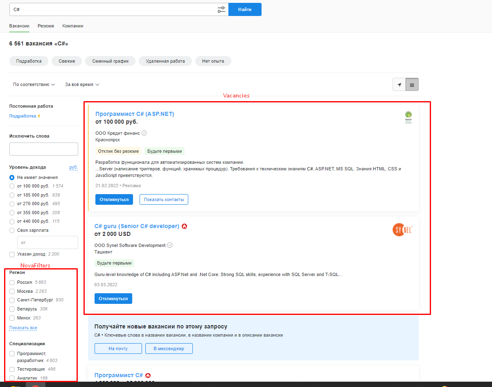

## HHVacancyParser

> **HHVacancyParser** - это очень простой в использовании инструмент для парсинга вакансий с сайта [hh.ru](https://hh.ru/search/vacancy) и дальнейшей работы с полученной информацией.

Основные возможности парсера:

 -  Парсинг вакансий по их названиям с возможностью передавать фильтры.
 - Парсинг конкретной страницы с вакансиями.
 - Обход нескольких страниц и сбор вакансий.
 - Настройка задержек перед обходом страниц.
 - Поддержка прокси.
 - Сбор не только вакансий, но и фильтров доступных для указанной вакансии.
 - Создание отчетов по вакансиям (Средняя зарплата в валютах, коэффициент вариации, кол-во зарплат в валютах и т.п.)

Изображение страницы вакансий где происходит сбор данных:


## Начало работы

> **HHVacancyParser.Core** - это основное ядро парсера, которое содержит в себе все необходимые инструменты для парсинга и формирования отчетов, а также модели данных.

## Основные типы необходимые для осуществления парсинга:
**HeadHunterClient** - Клиент который используется для парсинга вакансий с сайта [hh.ru](https://hh.ru/search/vacancy).

> Метод **SendAsync**:
> ```csharp
> // Отправляет запрос на сайт https://hh.ru/search/vacancy.
> // Возвращает результат парсинга в виде ответа от  https://hh.ru.
> Task<HeadHunterResponse> SendAsync(HeadHunterRequest request, CancellationToken cancellationToken = default);
> ```
> Метод **GoThroughPagesAsync**:
> ```csharp
> // Производит отправку запросов на указанные страницы.
> // После каждого запроса происходит задержка согласно DelayOptions
> Task<HeadHunterPagesTraversalResponse> GoThroughPagesAsync(HeadHunterPagesTraversalRequest request, CancellationToken cancellationToken = default);
> ```
> Событие **ParsedPage**:
> ```csharp
> // Генерируется после успешного парсинга страницы.
> event HeadHunterParsedPageEventHandler? ParsedPage;
> ```

**HeadHunterRequest** - Одноразовый запрос к сайту [hh.ru](https://hh.ru/search/vacancy):
> `HeadHunterRequest.SearchText` - Название искомой вакансии.<br>
> `HeadHunterRequest.Page` - Конкретная страница в поиске вакансии.<br>
> `HeadHunterRequest.Filters` - Фильтры для поиска вакансий.

**HeadHunterPagesTraversalRequest** - Запрос обходящий несколько страниц на сайте [hh.ru](https://hh.ru/search/vacancy).

> `HeadHunterPagesTraversalRequest.Request` - **HeadHunterRequest**.<br>
> `HeadHunterPagesTraversalRequest.Pages` - Массив страниц которые необходимо обойти.<br>
>  `HeadHunterPagesTraversalRequest.DelayOptions` - Настройка задержки после каждого запроса.
